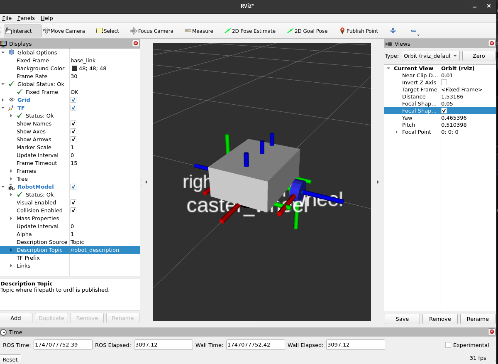

## Robot Package Template

This is a GitHub template. You can make your own copy by clicking the green "Use this template" button.

It is recommended that you keep the repo/package name the same, but if you do change it, ensure you do a "Find all" using your IDE (or the built-in GitHub IDE by hitting the `.` key) and rename all instances of `my_bot` to whatever your project's name is.

Note that each directory currently has at least one file in it to ensure that git tracks the files (and, consequently, that a fresh clone has direcctories present for CMake to find). These example files can be removed if required (and the directories can be removed if `CMakeLists.txt` is adjusted accordingly).

To build the package:

colcon build --symlink-install --packages-select my_bot

To launch:

ros2 launch my_bot rsp.launch.py

For RVIZ Visualization:

Open rviz.

rviz2

In rviz, add TF and RobotModel in the window on the right.

To view the wheels since they are continous/ rotating, run the joint_state_publisher_gui.

ros2 run joint_state_publisher_gui joint_state_publisher_gui 

XACROS:

- robot.urdf: brings all xacro/ urdf's together as one.
- robot_core: defines the components of the robot and the component's coordinate frames.

Notes:
- Joints come first, and are the coordiante frames.
- Links come next, and are the associated material in the model.
